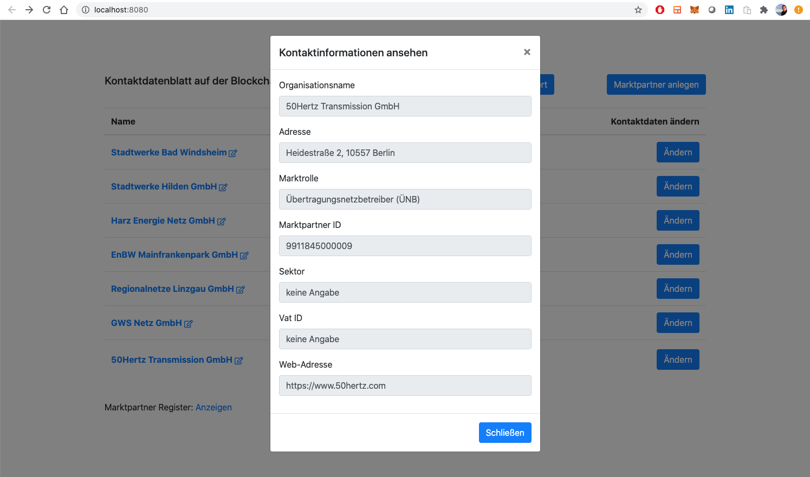

# "Kontaktdatenblatt" on Blockchain

### Register a new "Marktpartner":

### Show essential information for certificate issuing:

### List all "Marktpartner" including its verification status:

### Exemplarily verify a "Marktpartner" via a certificate issued by a trusted certificate authority:

### Trigger on-chain verification of provided certificate:

### On-chain verification taking place:

### Certificate successfully verified on-chain:

### Highlight verified "Marktpartner":

### Edit contact information via "Marktpartner":

### Contact information successfully edited:

### Show contact information of verified "Marktpartner":
