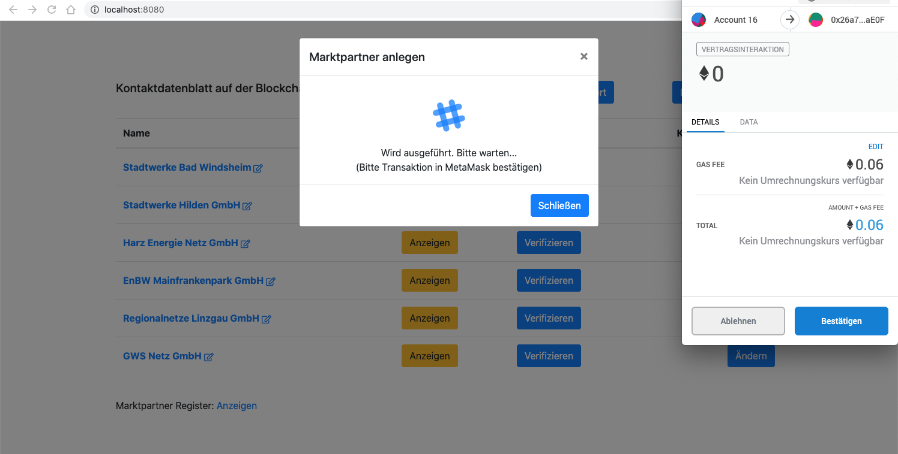
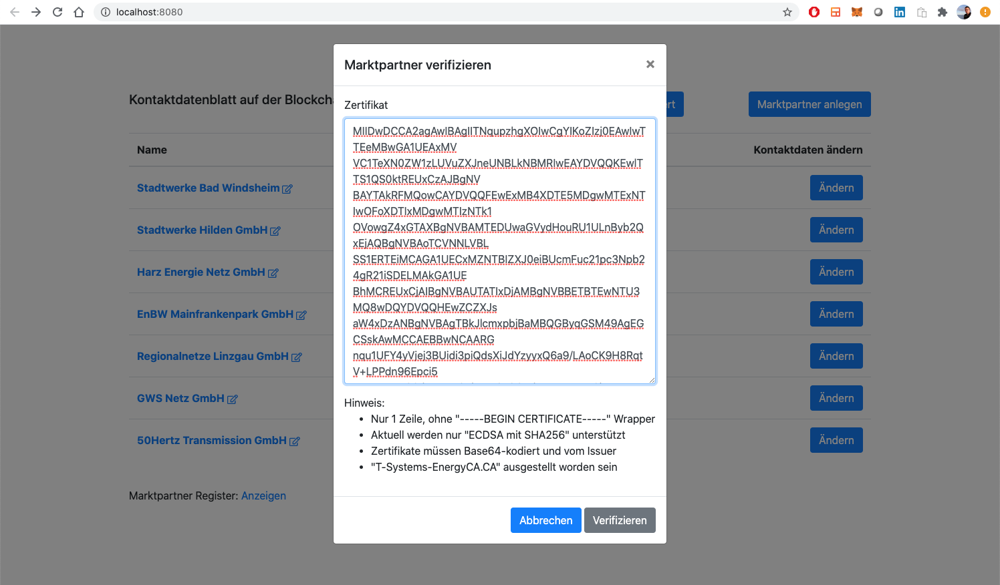
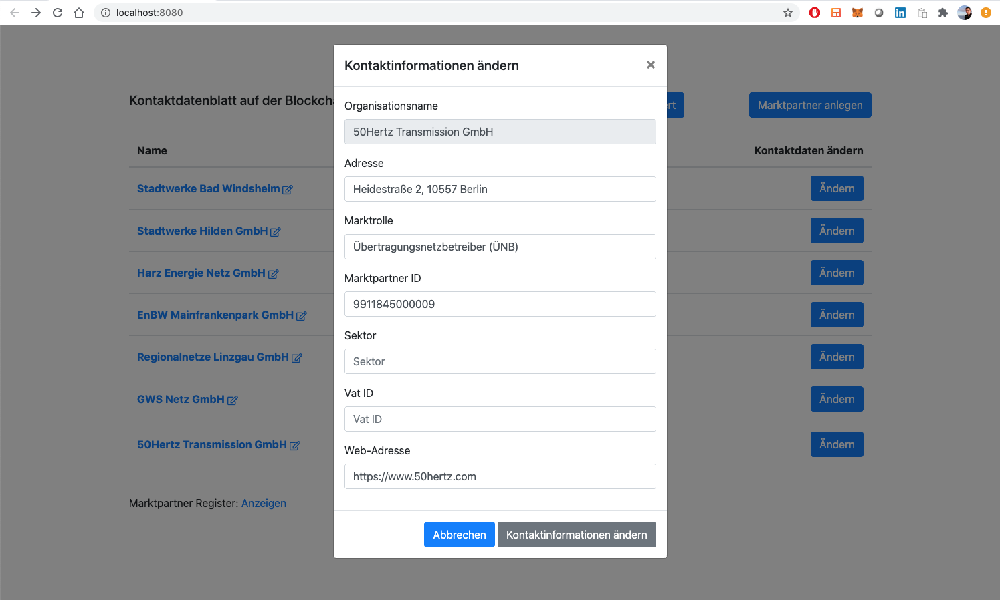

# "Kontaktdatenblatt" on Blockchain

## Introduction

Proof-of-concept for running "Kontaktdatenblatt" used for market communication in German energy industry on an Ethereum blockchain. The primary goal was to proof end-to-end verification of "Marktpartner" identities regarding their organisation names is possible purely on-chain using an on-chain verification algorithm (currently ECDSA with SHA256 supported) and existing certificates (SM-PKI EMT).

This work is inspired by discussions in [BCI-E+](https://blockchain-initiative.de), in particular the idea of leveraging existing SM-PKI EMT certificates for this use case.

## Architecture

### Smart contract architecture:

## Example

### "Marktpartner" registers itself ([DID](https://www.w3.org/TR/did-core/)):

### Show data to be included in a certificate:

### List all "Marktpartner" including their verification status:

### Exemplarily verify a "Marktpartner" via a certificate issued by a trusted certificate authority:

### Trigger on-chain verification of provided certificate:

### On-chain verification of provided certificate:

### Certificate successfully verified on-chain:

### Verified "Marktpartner" highlighted accordingly:

### Edit additional contact information (besides organisation name, which has been extracted from the certificate):

### Confirm contact information update:

### Contact information successfully edited:

### Show contact information of verified "Marktpartner":

## Installation

The following instructions assume an execution on localhost. However, feel free to execute the code on any Ethereum-based blockchain (with a gas limit of at least 25 Mio.).

1. Install [Ganache](https://www.trufflesuite.com/ganache). Important: A gas limit of at least 25 Mio. is required. We recommend to set it to 30 Mio. Open Ganache => Settings => Chain

2. Install [Metamask](https://metamask.io/) in your browser. Once installed, import one of the prefuned accounts and connect Metamask to your Ganache private chain (default: http://localhost:7545) 

3. Git clone the repo to your local machine via *git clone --recurse-submodules git@github.com:BlockInfinity/kontaktdatenblattOnBlockchain.git*

4. Use [Remix](https://remix.ethereum.org/) (or any other client) to deploy ./contracts/Register.sol (and all imported contracts) to your Ganache chain. Important note: Register.sol's constructor requires 2 parameters. Use the following values for them.

* pk_x = 0x686A332A465F38F17CC6541CB939CE1237CF8C2EFC1A28D8DD93191CCDD760BC
* pk_y = 0x48CEC4C40D2C0EBB7F1626C77FC8BD8573948600658BF6B8DFFBB2559A5EA8B7

5. *cd ./webapp && npm install*

6. Configure contract address of the previously deployed contract (4) in /webapp/src/api/blockchainApi.js at variable "registerContractAddress".

7. Start the app via *npm run start-dev*

Hint: In ./misc you find the official PKI EMT certificate of "50Hertz Transmission GmbH" you may use for verification testing (downloaded [here](https://www.50hertz.com/de/Vertragspartner/Marktkommunikation)). However, any ECDSA (with SHA256) based signature should work. 